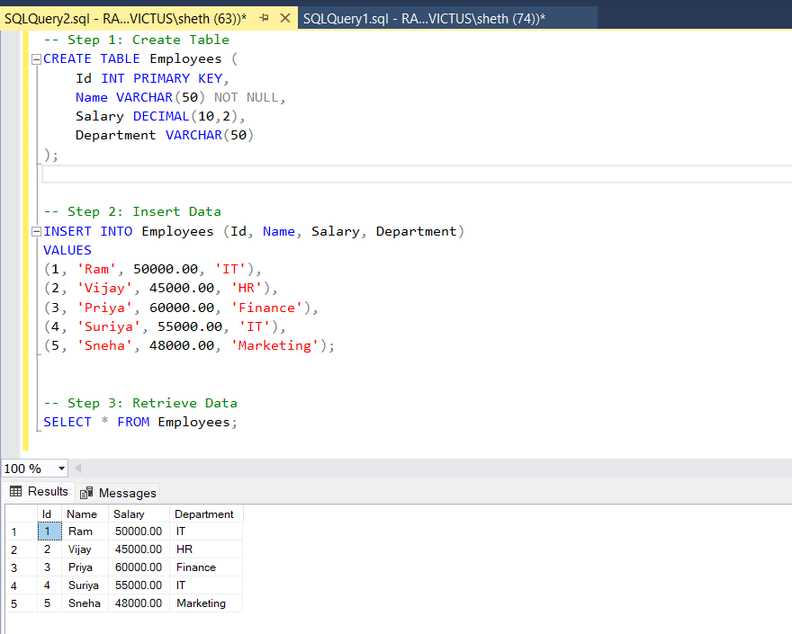

# 📌 SQL-01: Create, Insert, and Retrieve Data

---

## 🎯 Objective

To understand the fundamental operations in SQL by:

* Creating a database and table
* Inserting multiple records
* Retrieving data using basic queries

---

## 📋 Requirements

* Use `CREATE DATABASE` and `USE` to initialize the database
* Use `CREATE TABLE` to define structure with appropriate data types and constraints
* Use `INSERT INTO` to add multiple rows
* Use `SELECT` to retrieve and verify inserted data

---

## 🛠️ Implementation

### 🔹 Step 1: Create Database

* Created a database named `InternshipDB`
* Switched context to the created database

### 🔹 Step 2: Create Table

* Created a table `Employees` with the following columns:

  * `Id` → Integer, Primary Key
  * `Name` → Text, Not Null
  * `Salary` → Decimal
  * `Department` → Text

### 🔹 Step 3: Insert Data

* Inserted multiple employee records into the table
* Ensured correct column order and data types

### 🔹 Step 4: Retrieve Data

* Used `SELECT * FROM Employees;` to fetch all records
* Verified successful insertion of data

---

## 📸 Output

* Database created successfully
* Table created and visible in Object Explorer
* Data inserted without errors
* Query output displayed all inserted rows

---

## 📚 Learnings

* Understood how relational databases store data in tables
* Learned how to define schema using `CREATE TABLE`
* Practiced inserting multiple rows using `INSERT INTO`
* Retrieved data using `SELECT` queries
* Gained clarity on basic data types and constraints

---

