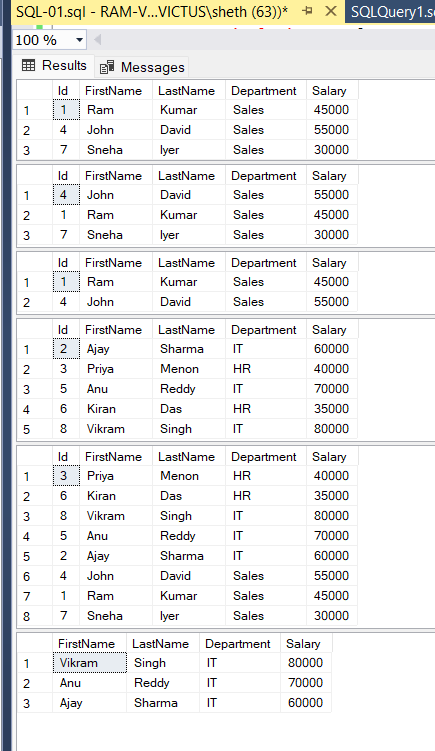

# 📌 Task: SQL Filtering and Sorting

---

## 🎯 Objective

Write SQL queries to filter records and sort the result set using `WHERE`, `ORDER BY`, and multiple conditions.

---

## 📋 Requirements

* Use `WHERE` to filter records
* Apply `ORDER BY` to sort results
* Use `AND` / `OR` for multiple conditions

---

## 🛠️ Implementation

### 🔹 Database & Table Setup

* Created a database: `CompanyDB`
* Created table: `Employees`
* Columns:

  * `Id` (Primary Key)
  * `FirstName`
  * `LastName`
  * `Department`
  * `Salary`

### 🔹 Data Inserted

* Added multiple employee records across departments:

  * Sales
  * IT
  * HR

---

## ⚙️ Queries Implemented

### ✅ 1. Filter Records

* Retrieved employees from a specific department using `WHERE`

### ✅ 2. Filter + Sort

* Filtered employees and sorted them by salary (descending)

### ✅ 3. Multiple Conditions (AND)

* Applied strict filtering using department and salary conditions

### ✅ 4. Multiple Conditions (OR)

* Retrieved employees belonging to multiple departments

### ✅ 5. Multi-Column Sorting

* Sorted data by department and salary

### ✅ 6. Advanced Query

* Selected specific columns with combined filtering and sorting

---

## 📸 Output

* Successfully retrieved filtered datasets
* Verified sorting in ascending and descending order
* Validated multiple condition queries (`AND` / `OR`)

---

## 💡 Learnings

* Understood how `WHERE` filters rows before output
* Learned how `ORDER BY` controls result ordering
* Practiced combining conditions using `AND` and `OR`
* Gained clarity on writing clean and readable SQL queries

---
