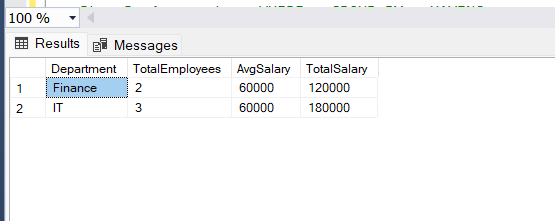

# 📊 SQL Task: Aggregate Functions & GROUP BY

---

## 🎯 Objective

Understand how to summarize data using aggregate functions and organize it using grouping. Learn how filtering works before and after grouping using WHERE and HAVING.

---

## 📋 Requirements

* Use aggregate functions such as COUNT, SUM, and AVG
* Group data based on a specific column
* Apply filtering before grouping using WHERE
* Apply filtering after grouping using HAVING

---

## 🛠️ Implementation

* Created a table representing employees with attributes like department and salary
* Inserted sample data to simulate real-world scenarios
* Applied row-level filtering using WHERE to restrict data before grouping
* Grouped data based on department to form logical clusters
* Applied aggregate functions on each group to calculate:

  * Total employees
  * Average salary
  * Total salary
* Used HAVING to filter groups based on conditions (e.g., minimum number of employees)

---

## ⚙️ Key Concepts Learned

### 🔹 Aggregate Functions

Used to perform calculations on multiple rows and return a single summarized value.

### 🔹 GROUP BY

Used to divide data into groups so that aggregate functions can be applied to each group separately.

### 🔹 WHERE vs HAVING

* WHERE filters rows before grouping
* HAVING filters groups after aggregation

### 🔹 Execution Flow

Data is first filtered, then grouped, then aggregated, and finally filtered again if needed.

### 🔹 Important Rule

When using GROUP BY, all selected columns must either be part of the grouping or be used inside an aggregate function to avoid ambiguity.

---

## 📈 Output

---

## 🧠 Learnings

* Understood the difference between row-level and group-level filtering
* Learned how SQL processes queries step-by-step internally
* Avoided common mistakes like using aggregate functions inside WHERE
* Gained clarity on how grouping resolves large datasets into meaningful summaries

---
