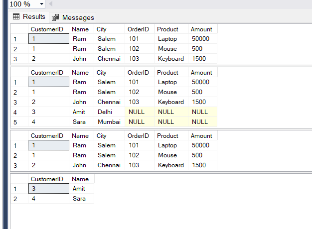

# 📘 SQL Task: JOIN Operations 
---

## 🎯 Objective

To understand how to combine data from multiple tables using JOIN operations.

---

## 📋 Requirements

* Create two related tables (Customers and Orders)
* Establish a relationship using a Foreign Key
* Perform JOIN operations (INNER, LEFT, RIGHT)
* Understand how Foreign Key prevents invalid data
* Learn execution order of SQL queries

---

## 🛠️ Implementation

### 1. Table Design

* Created `Customers` table as the parent
* Created `Orders` table as the child
* Linked both using `CustomerID`

### 2. Foreign Key Constraint

* Ensures that every order is linked to a valid customer
* Prevents insertion of invalid references
* Avoids orphan records

### 3. JOIN Operations

* **INNER JOIN**: Fetch only matching records between Customers and Orders
* **LEFT JOIN**: Fetch all customers, even if they have no orders
* **RIGHT JOIN**: Fetch all orders, even if no matching customer exists

### 4. Data Integrity Handling

* Invalid inserts are blocked when Foreign Key is applied
* Parent deletion is restricted if child records exist
* Can be controlled using CASCADE rules

### 5. Query Execution Understanding

* Queries are executed in a specific internal order
* JOIN and ON are processed before WHERE
* GROUP BY and HAVING are applied after filtering

---

## ⚙️ Key Concepts Learned

* JOIN combines related tables using matching conditions
* ON defines how tables are connected
* WHERE filters rows before grouping
* HAVING filters grouped data
* Foreign Key enforces referential integrity
* Execution order differs from syntax order

---

## 📊 Outcome

---

## 🚀 Learnings

* Proper JOIN usage improves query performance
* Foreign Keys are essential for maintaining clean and reliable databases
* Misplacing conditions (ON vs WHERE) can change query results
* Understanding execution order is critical for writing correct queries

---

