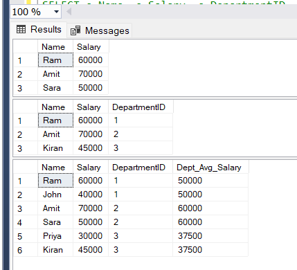

# 📘 SQL Task – Subqueries & Derived Tables

---

## 🎯 Objective

To understand and implement subqueries in SQL for filtering and computation, and to differentiate between correlated and non-correlated subqueries. Additionally, to learn how derived tables work and when to use optimized approaches.

---

## 📋 Requirements

* Use a subquery in the WHERE clause to filter data
* Use a correlated subquery for group-based filtering
* Use a subquery in the SELECT clause to compute dynamic values
* Understand derived tables and their behavior
* Compare subqueries with optimized JOIN-based approaches

---

## 🛠️ Implementation

* Created an Employees dataset with attributes like Name, Salary, and Department
* Implemented a non-correlated subquery to filter employees earning above the overall average salary
* Implemented a correlated subquery to filter employees earning above their department average
* Used a subquery in the SELECT clause to dynamically compute department-wise average salary for each employee
* Built a derived table using a subquery inside the FROM clause to generate aggregated department-level data
* Joined the derived table with the main table to replicate correlated subquery logic in a more optimized way

---

## 🧠 Key Concepts Learned

### 🔹 Subquery

A query written inside another query, used to compute intermediate results.

### 🔹 Non-Correlated Subquery

* Executes once
* Independent of the outer query

### 🔹 Correlated Subquery

* Executes for each row
* Depends on values from the outer query

### 🔹 Derived Table

* A subquery placed inside the FROM clause
* Acts like a temporary table during execution
* Requires an alias

### 🔹 Subquery vs Derived Table

* Subquery is used for filtering or value computation
* Derived table is used to create intermediate datasets for further operations

### 🔹 Subquery vs Nested Query

* Both terms refer to the same concept
* "Subquery" is the standard SQL term

---

## ⚡ Optimization Insight

* Correlated subqueries can be expensive as they execute per row
* Using JOIN with aggregated results improves performance
* Derived tables help precompute values efficiently before joining

---

## 📊 Output

---

## 📚 Learnings

* Understood execution flow of subqueries
* Learned when to use correlated vs non-correlated subqueries
* Gained clarity on derived tables and their temporary nature
* Realized importance of optimization using JOIN over correlated subqueries

---

