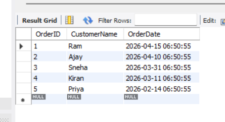
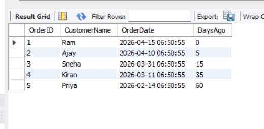
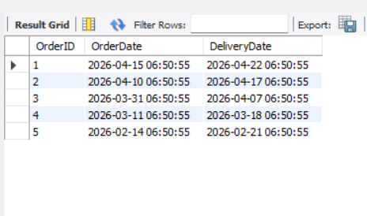

# 📅 Task: SQL Date & Time Manipulation

---

## 🎯 Objective

To manipulate and query data using date and time functions in MySQL, including calculating intervals, filtering records based on date ranges, and formatting date outputs.

---

## 📋 Requirements

* Use built-in date functions such as `DATEDIFF`, `DATE_ADD`, and `DATE_SUB`
* Filter records based on date ranges (e.g., last 30 days)
* Format date outputs using appropriate functions
* Demonstrate understanding of performance considerations in date queries

---

## ⚙️ Implementation

### 1. Date Functions Usage

* Calculated number of days since each order using `DATEDIFF`
* Generated future dates (e.g., delivery date) using `DATE_ADD`

---

### 2. Filtering by Date Range

* Retrieved records from the last 30 days using:

  * `DATE_SUB(NOW(), INTERVAL 30 DAY)`

* Ensured efficient querying by avoiding functions on indexed columns

---

### 3. Date Formatting

* Formatted date output into readable format using `DATE_FORMAT`
* Used format specifiers like `%d`, `%m`, `%Y`

---

### 4. Additional Date Operations

* Extracted specific parts of date (month, year)
* Retrieved day names using `DAYNAME`
* Calculated last day of the month using `LAST_DAY`

---

## Sample outputs

---

---

---

## 🚀 Key Learnings

* `INTERVAL` is essential for date arithmetic in MySQL
* `DATEDIFF` is useful for calculating differences but should be used carefully in filtering
* Avoid applying functions directly on columns in `WHERE` clause to maintain performance
* Direct comparison using calculated values enables index usage and faster queries
* Date formatting is for display purposes and does not affect stored data

---

## ⚠️ Performance Consideration

### ❌ Inefficient Approach

* Using functions like `DATEDIFF` directly on columns in `WHERE` clause
* Causes full table scan and slows down queries

### ✅ Optimized Approach

* Comparing column values directly using `DATE_SUB`
* Enables index usage and improves performance

---

