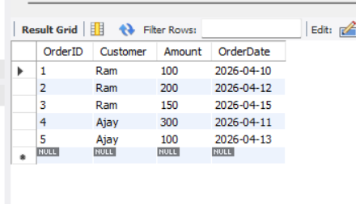
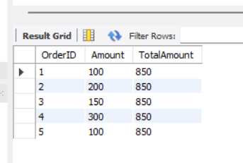
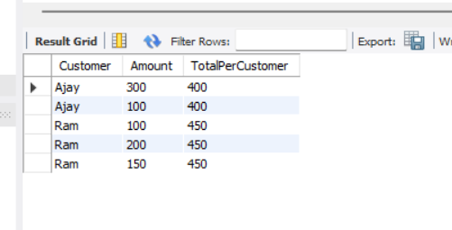

# 📊 Task: SQL Window Functions (MySQL)

---

## 🎯 Objective

To understand and implement SQL window functions in MySQL for performing advanced calculations such as running totals, rankings, and partition-based aggregations without reducing rows.

---

## 📋 Requirements

* Use window functions with `OVER()` clause
* Apply `PARTITION BY` for grouped calculations
* Use `ORDER BY` inside window functions for sequential computations
* Implement ranking functions (`ROW_NUMBER`, `RANK`, `DENSE_RANK`)
* Demonstrate running totals using ascending and descending order
* Understand execution flow and behavior differences

---

## 🧱 Database Setup

* Created database: `WindowPractice`
* Created table: `Orders`

### Table Structure:

* `OrderID` (Primary Key)

* `Customer`

* `Amount`

* `OrderDate`

* Inserted sample data for multiple customers with varying order dates and amounts

---

## ⚙️ Implementation

### 1. Basic Window Function

* Used `SUM() OVER()` to calculate total across all rows
* Demonstrated that window functions do not reduce rows

---

### 2. Partition-Based Aggregation

* Applied `PARTITION BY Customer` to calculate totals per customer
* Maintained row-level details while computing grouped values

---

### 3. Running Totals

* Used `ORDER BY` inside `OVER()` to compute cumulative totals
* Demonstrated behavior using:

  * Ascending order → past to present accumulation
  * Descending order → present to past accumulation

---

### 4. Ranking Functions

* Implemented:

  * `ROW_NUMBER()` → unique ranking
  * `RANK()` → allows gaps in ranking
  * `DENSE_RANK()` → no gaps in ranking

---

### 5. Window Frame (Advanced)

* Used explicit frame:

  * `ROWS BETWEEN UNBOUNDED PRECEDING AND CURRENT ROW`
* Controlled how many rows participate in calculation

---

### 6. Subquery with Window Functions

* Used subquery to filter ranked results
* Example: retrieving top-ranked customer

---

## 🔄 Execution Flow Understanding

SQL execution order:

1. FROM
2. WHERE
3. GROUP BY
4. HAVING
5. SELECT
6. WINDOW FUNCTIONS (OVER)
7. ORDER BY

* Window functions are applied after aggregation but before final sorting

---

## Output

---

---

---

## ⚠️ Key Observations

* `ORDER BY` inside `OVER()` affects calculation, not just display
* Without `ORDER BY`, calculations are performed on full partition
* With `ORDER BY`, calculations become cumulative (running window)
* Window functions cannot be used directly in `WHERE` clause
* Subqueries are required for filtering window results

---

## 🚀 Key Learnings

* Window functions allow advanced analytics without losing row-level data
* `PARTITION BY` is similar to grouping but preserves rows
* `ORDER BY` defines calculation sequence within partitions
* Ranking and running totals are common real-world use cases
* Proper understanding improves query performance and readability

---

