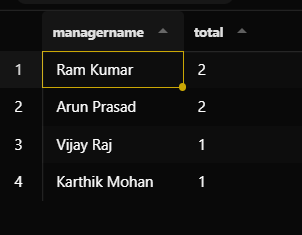
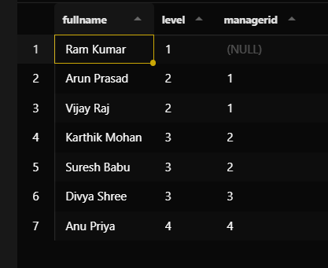

# 📊 Task: SQL CTE & Recursive CTE

---

## 🎯 Objective

To understand and implement **Common Table Expressions (CTE)** and **Recursive CTEs** for simplifying complex queries and handling hierarchical data efficiently.

---

## 📋 Requirements

* Use `WITH` clause to create CTEs
* Break complex queries into readable steps
* Implement recursive queries using self-referencing CTEs
* Handle hierarchical data (tree structures)
* Prevent infinite loops using cycle handling techniques
* Understand execution flow of recursive queries

---

## 🧱 Database Setup

* Created table: `Employees`

### Table Structure:

* `EmployeeID` (Primary Key)

* `FirstName`

* `LastName`

* `ManagerID` (Self-referencing foreign key)

* Inserted hierarchical sample data (CEO → Managers → Employees → Interns)

---

## ⚙️ Implementation

### 1. Non-Recursive CTE

* Used `WITH` to simplify multi-step queries
* Example use-case:

  * Aggregating employee counts per manager
* Improved readability by breaking query into logical steps

---

### 2. Recursive CTE

* Used `WITH RECURSIVE` for hierarchical traversal
* Structured into:

  * **Base Case** → Starting node (e.g., CEO)
  * **Recursive Case** → Repeated self-join to fetch next level

---

### 3. Hierarchy Processing

* Generated levels dynamically
* Traversed unknown depth structure
* Output maintained row-level hierarchy with levels

---

### 4. UNION ALL Usage

* Used `UNION ALL` to combine base and recursive results
* Ensures:

  * No duplicate elimination overhead
  * Correct accumulation of rows

---

### 5. Cycle Handling (Important)

* Identified risk of infinite loops in cyclic data

#### Methods:

* **Natural termination** → stops when no new rows
* **Depth limit** → restrict recursion levels
* **Path tracking** → prevent revisiting nodes
* **PostgreSQL CYCLE clause** → built-in cycle detection

---

## 🔄 Execution Flow Understanding

Recursive CTE executes in iterations:

1. Base query runs once
2. Result stored as working set
3. Recursive query runs using only new rows
4. Results appended
5. Stops when no new rows are generated

---

## Outputs 

### Non recurive CTE 

---
### Recursive CTE 

---

## ⚠️ Key Observations

* Recursive queries process data level-by-level
* Only latest iteration rows are used in next step
* `UNION ALL` does not remove duplicates
* Infinite loops occur only with cyclic data
* Cycle detection is essential for safe recursion

---

## 🚀 Key Learnings

* CTE improves readability and structure of queries
* Recursive CTE enables traversal of hierarchical data
* Normal joins cannot handle unknown depth
* Cycle prevention is critical in real-world scenarios
* Recursive queries are powerful for tree and graph problems

---

## 🧠 Final Summary

* **CTE** → simplifies complex queries
* **Recursive CTE** → solves hierarchical problems
* **Termination** → no new rows OR cycle prevention

---
